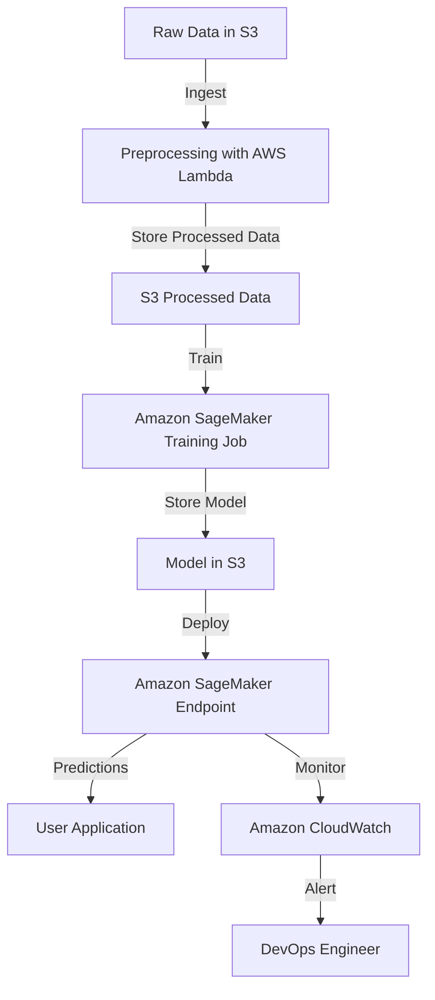

# AWS MLOps: End-to-End Machine Learning Pipeline using Amazon SageMaker

## Overview
This guide provides an end-to-end **AWS MLOps** pipeline using **Amazon SageMaker** to automate ML workflows. It includes **data ingestion, model training, model deployment, and monitoring** in a cost-effective way.

## Architecture Diagram



## Steps to Build the MLOps Pipeline

### 1. **Setup AWS Environment**
- Create an **AWS IAM Role** with the following permissions:
  - Amazon S3 (Read/Write for datasets and models)
  - Amazon SageMaker (Full Access)
  - AWS Lambda (For automation)
  - AWS CloudWatch (For monitoring logs)

### 2. **Data Ingestion & Preprocessing**
#### Storing raw data in an Amazon S3 bucket using AWS CloudFormation
Create an S3 bucket using the following **CloudFormation** template:

```yaml
Resources:
  MLDataBucket:
    Type: AWS::S3::Bucket
    Properties:
      BucketName: mlops-raw-data-bucket
```

Upload raw data to this bucket using the AWS CLI:

```sh
aws s3 cp data.csv s3://mlops-raw-data-bucket/
```

#### Using AWS Lambda for Data Preprocessing
Create an **AWS Lambda function** that reads raw data from S3, preprocesses it, and stores it in another S3 bucket:

```python
import boto3
import pandas as pd
from io import StringIO

def lambda_handler(event, context):
    s3 = boto3.client('s3')
    raw_bucket = 'mlops-raw-data-bucket'
    processed_bucket = 'mlops-processed-data-bucket'
    file_key = 'data.csv'

    # Read raw data from S3
    response = s3.get_object(Bucket=raw_bucket, Key=file_key)
    df = pd.read_csv(response['Body'])
    
    # Preprocess data (e.g., handle missing values)
    df.fillna(0, inplace=True)
    
    # Convert DataFrame to CSV and upload to processed S3 bucket
    csv_buffer = StringIO()
    df.to_csv(csv_buffer, index=False)
    s3.put_object(Bucket=processed_bucket, Key='processed_data.csv', Body=csv_buffer.getvalue())
```

### 3. **Model Training in Amazon SageMaker**
#### Creating a SageMaker Training Job
- Define a **Docker container** with the required ML framework (TensorFlow, PyTorch, Scikit-Learn, etc.).
- Use **Amazon SageMaker SDK** to initiate model training.
- Store trained model artifacts in S3.

```python
import boto3
import sagemaker
from sagemaker import get_execution_role

try:
    role = get_execution_role()
except Exception as e:
    print(f"Error retrieving execution role: {e}")
    raise

sess = sagemaker.Session()

estimator = sagemaker.sklearn.SKLearn(
    entry_point='train.py',
    role=role,
    instance_type='ml.m5.large',
    framework_version='0.23-1',
    output_path=os.getenv('S3_OUTPUT_PATH', 's3://mlops-model-bucket/output/')  # Use environment variable for flexibility
)
estimator.fit({'train': 's3://mlops-processed-data-bucket/processed_data.csv'})
```

### 4. **Model Deployment with Amazon SageMaker Endpoint**
- Deploy the trained model as a **SageMaker Endpoint** for real-time inference.

```python
try:
    predictor = estimator.deploy(
        initial_instance_count=1,
        instance_type='ml.m5.large'
    )
except Exception as e:
    print(f"Error deploying model: {e}")
    raise
```

### 5. **Automating Model Deployment using CI/CD (AWS CodePipeline + CodeBuild)**
- **AWS CodePipeline** automates the deployment process.
- **AWS CodeBuild** triggers model deployment when a new model is trained and stored in S3.

```yaml
stages:
  - name: Source
    actions:
      - name: GetCode
        actionTypeId:
          category: Source
          owner: AWS
          provider: S3
  - name: Build
    actions:
      - name: BuildAndDeploy
        actionTypeId:
          category: Build
          owner: AWS
          provider: CodeBuild
```

### 6. **Monitoring & Logging with CloudWatch**
- Enable logging in **Amazon CloudWatch** to track model performance.
- Set up an **Amazon CloudWatch Alarm** to notify in case of **high latency or failures**.

```python
cloudwatch = boto3.client('cloudwatch')
cloudwatch.put_metric_alarm(
    AlarmName='SageMakerEndpointLatency',
    MetricName='Latency',
    Namespace='AWS/SageMaker',
    Threshold=500,  # Consider dynamically adjusting based on historical data
    ComparisonOperator='GreaterThanThreshold',
    Period=60,
    EvaluationPeriods=2
)
```

### 7. **Cost Optimization Strategies**
- **Use Spot Instances** for training jobs to save up to 70%.
- **Enable Auto Scaling** for endpoints based on demand.
- **Delete Unused Endpoints** to avoid unnecessary costs.

### 8. **Testing the Model**
- Invoke the deployed model using the **boto3 SDK**.

```python
response = predictor.predict(data)
print("Prediction:", response)
```

### 9. **Cleanup Resources**
- Delete SageMaker Endpoint to avoid ongoing charges.

```python
try:
    predictor.delete_endpoint()
except Exception as e:
    print(f"Error deleting endpoint: {e}")
```

## Conclusion
This project provides an end-to-end MLOps pipeline using **Amazon SageMaker** with cost-effective strategies. The setup automates **data ingestion, training, deployment, and monitoring** using AWS services.

## Next Steps
- Extend with **feature store** for better data versioning.
- Implement **A/B testing** for multiple model versions.
- Use **AWS Step Functions** for advanced workflow automation.
