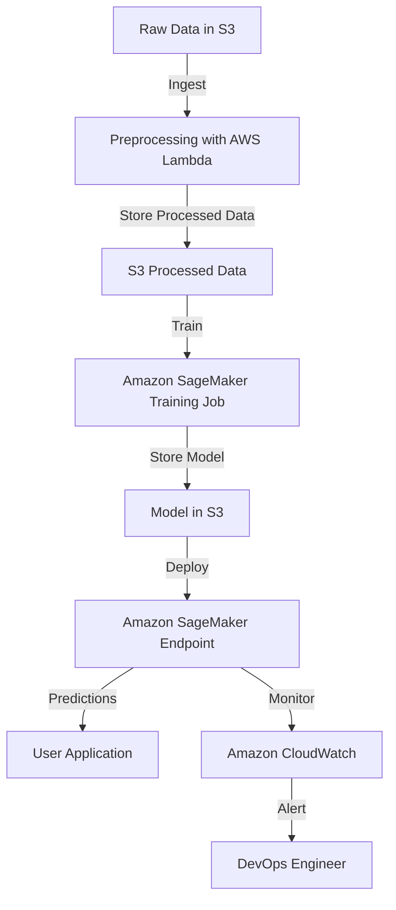

# AWS MLOps: End-to-End Machine Learning Pipeline using Amazon SageMaker

## Overview
This guide provides an end-to-end **AWS MLOps** pipeline using **Amazon SageMaker** to automate ML workflows. It includes **data ingestion, model training, model deployment, and monitoring** in a cost-effective way.

## Architecture Diagram



## Steps to Build the MLOps Pipeline

### 1. **Setup AWS Environment**
- Create an **AWS IAM Role** with the following permissions:
  - Amazon S3 (Read/Write for datasets and models)
  - Amazon SageMaker (Full Access)
  - AWS Lambda (For automation)
  - AWS CloudWatch (For monitoring logs)

### 2. **Data Ingestion & Preprocessing**
- Store raw data in an **Amazon S3** bucket.
- Use an **AWS Lambda function** to:
  - Perform basic **data cleaning**
  - Store preprocessed data in another S3 bucket

### 3. **Model Training in Amazon SageMaker**
- Create a **SageMaker Training Job** with the following steps:
  1. Define a **Docker container** with ML framework (TensorFlow, PyTorch, Scikit-Learn, etc.).
  2. Use **Amazon SageMaker SDK** to initiate model training.
  3. Store trained model artifacts in S3.

```python
import boto3
import sagemaker
from sagemaker import get_execution_role

role = get_execution_role()
sess = sagemaker.Session()

estimator = sagemaker.sklearn.SKLearn(
    entry_point='train.py',
    role=role,
    instance_type='ml.m5.large',
    framework_version='0.23-1',
    output_path='s3://your-bucket/output/'
)
estimator.fit({'train': 's3://your-bucket/data/train.csv'})
```

### 4. **Model Deployment with Amazon SageMaker Endpoint**
- Deploy the trained model as a **SageMaker Endpoint** for real-time inference.

```python
predictor = estimator.deploy(
    initial_instance_count=1,
    instance_type='ml.m5.large'
)
```

### 5. **Automating Model Deployment using CI/CD (AWS CodePipeline + CodeBuild)**
- **AWS CodePipeline** automates the deployment process.
- **AWS CodeBuild** triggers model deployment when a new model is trained and stored in S3.

```yaml
stages:
  - name: Source
    actions:
      - name: GetCode
        actionTypeId:
          category: Source
          owner: AWS
          provider: S3
  - name: Build
    actions:
      - name: BuildAndDeploy
        actionTypeId:
          category: Build
          owner: AWS
          provider: CodeBuild
```

### 6. **Monitoring & Logging with CloudWatch**
- Enable logging in **Amazon CloudWatch** to track model performance.
- Set up an **Amazon CloudWatch Alarm** to notify in case of **high latency or failures**.

```python
cloudwatch = boto3.client('cloudwatch')
cloudwatch.put_metric_alarm(
    AlarmName='SageMakerEndpointLatency',
    MetricName='Latency',
    Namespace='AWS/SageMaker',
    Threshold=500,
    ComparisonOperator='GreaterThanThreshold',
    Period=60,
    EvaluationPeriods=2
)
```

### 7. **Cost Optimization Strategies**
- **Use Spot Instances** for training jobs to save up to 70%.
- **Enable Auto Scaling** for endpoints based on demand.
- **Delete Unused Endpoints** to avoid unnecessary costs.

### 8. **Testing the Model**
- Invoke the deployed model using the **boto3 SDK**.

```python
response = predictor.predict(data)
print("Prediction:", response)
```

### 9. **Cleanup Resources**
- Delete SageMaker Endpoint to avoid ongoing charges.

```python
predictor.delete_endpoint()
```

## Conclusion
This project provides an end-to-end MLOps pipeline using **Amazon SageMaker** with cost-effective strategies. The setup automates **data ingestion, training, deployment, and monitoring** using AWS services.

## Next Steps
- Extend with **feature store** for better data versioning.
- Implement **A/B testing** for multiple model versions.
- Use **AWS Step Functions** for advanced workflow automation.
